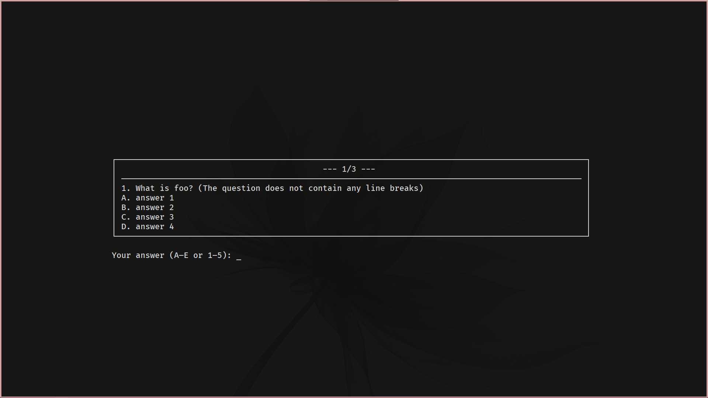

# Multiple-Choice

Simpler than Quizizz.
# Demo
 
---
# Usage
- Import your file with the same structure as **Questions.txt** file
- Run file RUN.bat or `python main.py` in your terminal.
- Press `Ctrl + C` to exit after answering a single question.
